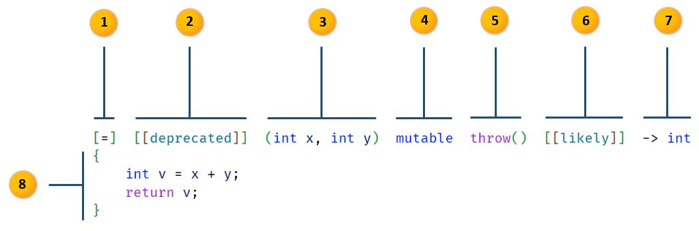

# Learning Modern C++

June 7, 2024

Author:

* [Janvier Anonical](http://www.linkedin.com/in/janvierja)

This is a living document and it that aids the author in keeping up-to-date with modern C++ (C++11 and newer).
The code in this document has been tested and compiled with GCC 13.2.0 built by the MSYS2.

Let's begin.

* [Lambda Expressions](#lambda-expressions)

 
 

### Lambda Expressions

Full detail on lambda can be found at here: [Lambda expressions](https://en.cppreference.com/w/cpp/language/lambda) at the [C++ Reference](https://en.cppreference.com/w/) site.

The illustration below shows the parts of a lambda syntax:
 
 

 
 

..and the syntax

> **[_captures_] _front-attr_(opt) (_params_) _specs_(opt) _exception_(opt) _back-attr_(opt) _trailing-type_(opt) { _body_ }**
 

1. **captures**
    
    
   The captures is a comma-separated list of zero or more captures, optionally beginning with the _capture-default_.
   The capture list defines the outside variables that are accessible from within the lambda function body.
    
    
   The only _capture-defaults_ are `&` and `=`.

   |||
   |---|---|
   |`&`|implicitly capture the used variables with automatic storage duration by reference|
   |`=`|implicitly capture the used variables with automatic storage duration by copy|
   
3. *front attribute spec*
4. *parameter list*
5. *specifier*
6. *exception spec*
7. *back attribute spec*
8. *trailing return type*
9. *lambda body*
